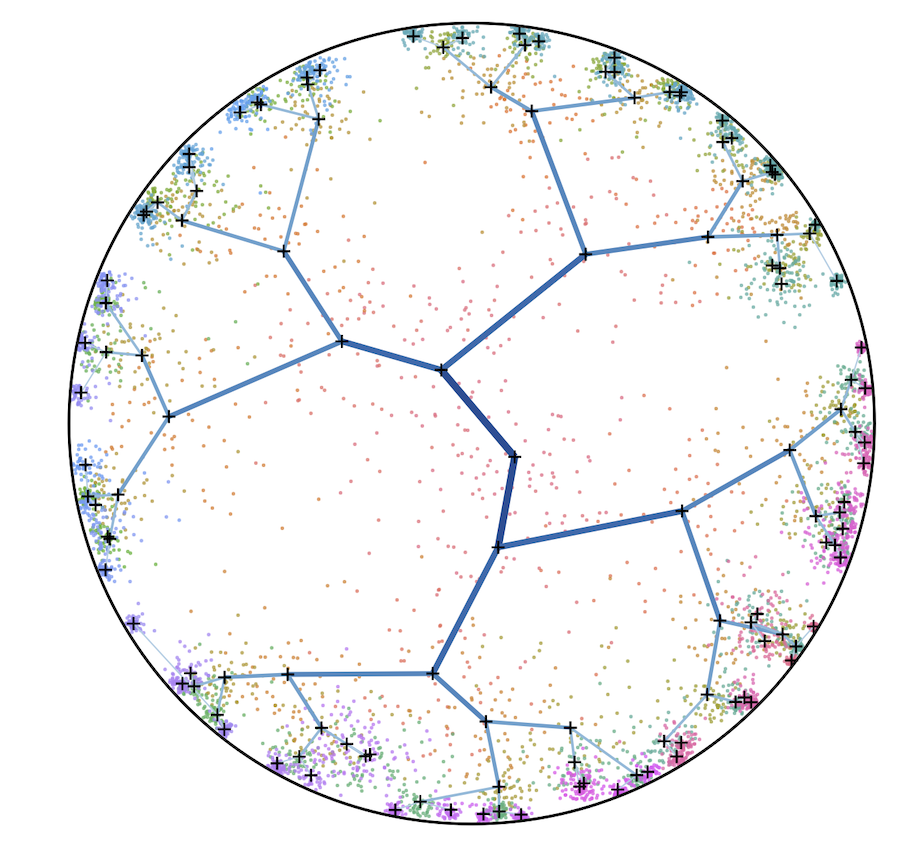

# [Continuous Hierarchical Representations with Poincaré Variational Auto-Encoders](https://arxiv.org/abs/1901.06033)



Code for reproducing the experiments in the paper:
```
@inproceedings{mathieu2019poincare,
  title={Continuous Hierarchical Representations with Poincar\'e Variational Auto-Encoders},
  author={Mathieu, Emile and Le Lan, Charline and Maddison, Chris J. and Tomioka, Ryota and Whye Teh, Yee},
  booktitle={Advances in Neural Information Processing Systems},
  year={2019}
}
```

## Prerequisites
`pip install -r -U requirements.txt` or `python3 setup.py install --user`

## Models

### VAE (`--manifold Euclidean`):
- Prior distribution (`--prior`): `Normal` (`WrappedNormal` is theoretically equivalent)
- Posterior distribution (`--posterior`): `Normal`  (`WrappedNormal` is theoretically equivalent)
- Decoder architecture (`--dec`): `Linear` (MLP) (`Wrapped` is theoretically equivalent)
- Encoder architecture (`--enc`): `Linear` (MLP) (`Wrapped` is theoretically equivalent)
    
### PVAE (`--manifold PoincareBall`):
- Curvature (`--c`): 1.0
- Prior distribution (`--prior`): `WrappedNormal` or `RiemannianNormal`
- Posterior distribution (`--posterior`): `WrappedNormal` or `RiemannianNormal`
- Decoder architecture (`--dec`):
    - `Linear` (MLP)
    - `Wrapped` (logarithm map followed by MLP),
    - `Geo` (first layer is based on geodesic distance to hyperplanes, followed by MLP)
    - `Mob` (based on Hyperbolic feed-forward layers from Ganea et al (2018))
- Encoder architecture (`--enc`): `Wrapped` or `Mob`


## Run experiments

### Synthetic dataset
```
python3 pvae/main.py --model tree --manifold PoincareBall --latent-dim 2 --hidden-dim 200 --prior-std 1.7 --c 1.2 --data-size 50 --data-params 6 2 1 1 5 5 --dec Wrapped --enc Wrapped  --prior RiemannianNormal --posterior RiemannianNormal --epochs 1000 --save-freq 1000 --lr 1e-3 --batch-size 64 --iwae-samples 5000
```

### MNIST dataset
```
python3 pvae/main.py --model mnist --manifold Euclidean             --latent-dim 2 --hidden-dim 600 --prior Normal        --posterior Normal        --dec Wrapped --enc Wrapped --lr 5e-4 --epochs 80 --save-freq 80 --batch-size 128 --iwae-samples 5000
python3 pvae/main.py --model mnist --manifold PoincareBall --c 0.7  --latent-dim 2 --hidden-dim 600 --prior WrappedNormal --posterior WrappedNormal --dec Geo     --enc Wrapped --lr 5e-4 --epochs 80 --save-freq 80 --batch-size 128 --iwae-samples 5000
```

### Custom dataset via csv file (placed in `/data`, no header, integer labels on last column)
```
python3 pvae/main.py --model csv --data-param CSV_NAME --data-size NB_FEATURES
```

